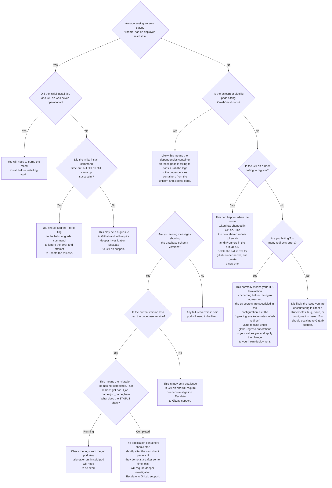
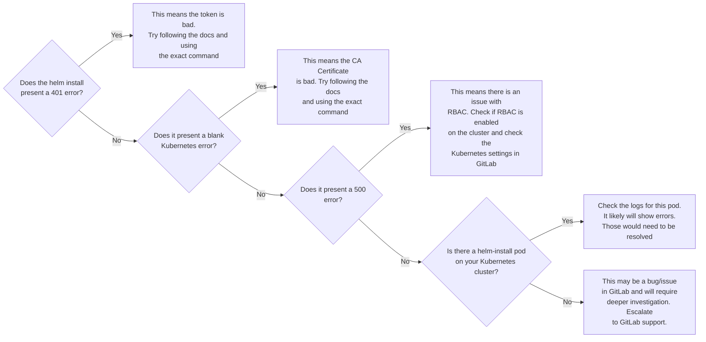

# Troubleshooting Kubernetes

Troubleshooting Kubernetes requires:

* Knowledge of common terms.
* Establishing which category the problem fits.
* Knowledge of Kubernetes and related tools (kubectl).

## Common Terminology

- **Annotation**: A key-value pair that is used to attach arbitrary
  non-identifying metadata to objects.
- **Applications**: The layer where various containerized applications run.
- **ConfigMap**: An API object used to store non-confidential data in key-value
  pairs. Can be consumed as environment variables, command-line arguments, or
  config files in a volume.
- **Cluster**: A set of machines, called nodes, that run containerized
  applications managed by Kubernetes. A cluster has at least one worker node and
  at least one master node.
- **ClusterRole**: A role contains rules that represent a set of permissions.
  Permissions are purely additive (there are no “deny” rules). At the
  instance level, it is called a ClusterRole.
- **ClusterRoleBinding**: A role binding grants the permissions defined in a
  role to a user or set of users. It holds a list of subjects (users, groups, or
  service accounts), and a reference to the role being granted. When applied at
  the instance level, it is called RoleBinding.
- **Container**: A lightweight and portable executable image that contains
  software and all of its dependencies.
- **Deployment**: An API object that manages a replicated application.
- **Helm Chart**: A package of pre-configured Kubernetes resources that can be
  managed with the Helm tool.
- **Ingress**: An API object that manages external access to the services in a
  cluster, typically HTTP.
- **Init Container**: One or more initialization containers that must run to
  completion before any app containers run.
- **Job**: A finite or batch task that runs to completion.
- **Kubectl**: A command line tool for communicating with a Kubernetes API
  server.
- **Kubelet**: An agent that runs on each node in the cluster. It makes sure
  that containers are running in a pod.
- **Kubernetes API**: The application that serves Kubernetes functionality
  through a RESTful interface and stores the state of the cluster.
- **Label**: Tags objects with identifying attributes that are meaningful and
  relevant to users.
- **Namespace**: An abstraction used by Kubernetes to support multiple virtual
  clusters on the same physical cluster.
- **Node**: A node is a worker machine in Kubernetes.
- **Persistent Volume**: An API object that represents a piece of storage in the
  cluster. Available as a general, pluggable resource that persists beyond the
  lifecycle of any individual Pod.
- **Persistent Volume Claim (PVC)**: Claims storage resources defined in a
  PersistentVolume so that it can be mounted as a volume in a container.
- **Pod**: The smallest and simplest Kubernetes object. A Pod represents a set
  of running containers on your cluster.
- **RBAC (Role-Based Access Control)**: Manages authorization decisions,
  allowing admins to dynamically configure access policies through the
  Kubernetes API.
- **Resource Quotas**: Provides constraints that limit aggregate resource
  consumption per Namespace.
- **Role**: A role contains rules that represent a set of permissions.
  Permissions are purely additive (there are no “deny” rules). At the
  namespace level, it is called a Role.
- **RoleBinding**: A role binding grants the permissions defined in a role to a
  user or set of users. It holds a list of subjects (users, groups, or service
  accounts), and a reference to the role being granted. When applied at the
  namespace level, it is called RoleBinding.
- **Secret**: Stores sensitive information, such as passwords, OAuth tokens, and
  ssh keys.
- **Service**: An abstract way to expose an application running on a set of Pods
  as a network service.
- **Service Account**: Provides an identity for processes that run in a Pod.
- **Volume**: A directory containing data, accessible to the containers in a
  pod.

## Kubernetes Workflows

### Helm Workflow

### Kubernetes Integration Workflow

