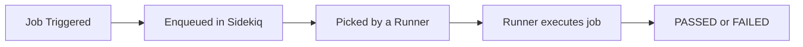
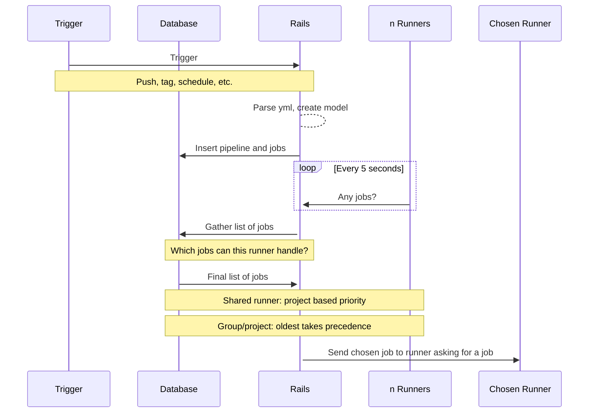
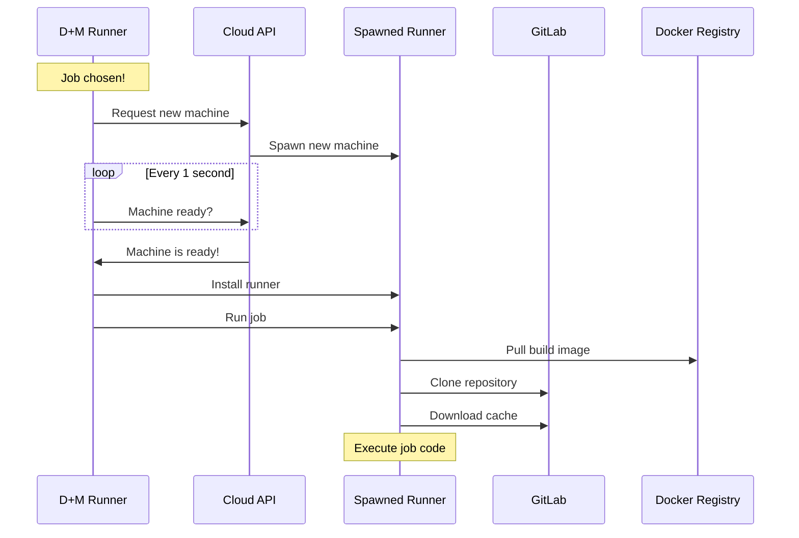

# Life of a GitLab CI/CD job

This document serves to map out the life of a GitLab job in GitLab CI/CD.  While an entire pipeline is made up of stages and many jobs, tracking the most basic unit of a pipeline - the job - from start to finish can help you understand the timing involved and the various moving pieces required for a job to start.

The sequence of jobs in stages and the pipeline overall are covered in various other parts of this documentation.  For the purposes of these diagrams, you can think of it tracing the "first" job in a pipeline (the first job in the first stage) or a pipeline that has exactly one stage and exactly one job.

Generally the life of a job looks something like:

Within each step above, there can be many steps - some which will take more time than others depending on a number of situations. The queue time for jobs will vary by available runners, the time from picking a job to execution can rely on the executor chosen, and so on.  In later sections, we will detail the specifics of these steps to understand in more depth the life of a job. 

## Trigger to Job Picked

## Picked to Execution (dependant on executor)
### Executor: docker+machine

