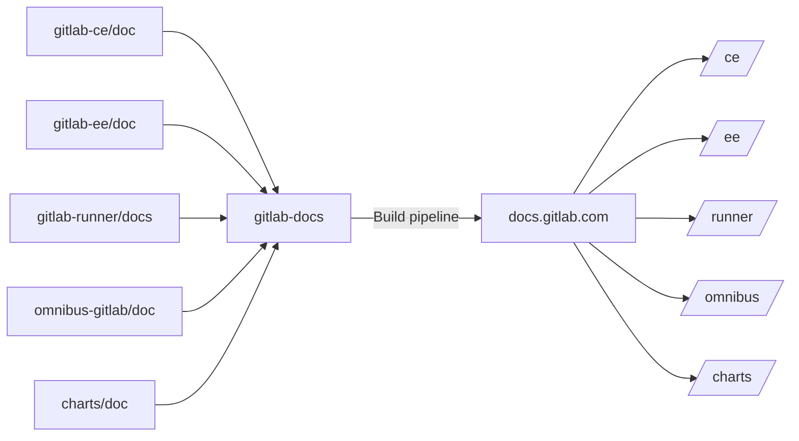

# Documentation site architecture

The [`gitlab-docs`](https://gitlab.com/gitlab-org/gitlab-docs) project hosts
the repository which is used to generate the GitLab documentation website and
is deployed to <https://docs.gitlab.com>. It uses the [Nanoc](http://nanoc.ws)
static site generator.

## Architecture

While the source of the documentation content is stored in GitLab's respective product
[repositories](#repositories), the source that is used to build the documentation
site _from that content_ is located at <https://gitlab.com/gitlab-org/gitlab-docs>.

The following diagram illustrates the relationship between the repositories
from where content is sourced, the `gitlab-docs` project, and the published output.



## Assets

To provide an optimized site structure, design, and a search-engine friendly
website, along with a discoverable documentation, we use a few assets for
the GitLab Documentation website.

### Libraries

- [Bootstrap 4.3.1 components](https://getbootstrap.com/docs/4.3/components/)
- [Bootstrap 4.3.1 JS](https://getbootstrap.com/docs/4.3/getting-started/javascript/)
- [jQuery](https://jquery.com/) 3.3.1
- [Clipboard JS](https://clipboardjs.com/)
- [Font Awesome 4.7.0](https://fontawesome.com/v4.7.0/icons/)

### SEO

- [Schema.org](https://schema.org/)
- [Google Analytics](https://marketingplatform.google.com/about/analytics/)
- [Google Tag Manager](https://developers.google.com/tag-manager/)

## Global nav

To understand how the global nav (left sidebar) is built, please
read through the [global navigation](global_nav.md) doc.

<!--
## Helpers

TBA
-->

## Repositories

You will not find any GitLab docs content in the `gitlab-docs` repository.
All documentation files are hosted in the respective repository of each
product, and all together are pulled to generate the docs website:

- [GitLab Enterprise Edition](https://gitlab.com/gitlab-org/gitlab-ee)
- [GitLab Community Edition](https://gitlab.com/gitlab-org/gitlab-ce)
- [Omnibus GitLab](https://gitlab.com/gitlab-org/omnibus-gitlab)
- [GitLab Runner](https://gitlab.com/gitlab-org/gitlab-runner)
- [GitLab Chart](https://gitlab.com/charts/gitlab)

NOTE: **Note:**
Although GitLab Community Edition is generated, it is hidden from the website
as it's a subset of the Enterprise Edition. We generate it for consistency,
until the [GitLab codebase is unified](https://gitlab.com/gitlab-org/gitlab-ee/issues/2952).

## Using YAML data files

The easiest way to achieve something similar to
[Jekyll's data files](https://jekyllrb.com/docs/datafiles/) in Nanoc is by
using the [`@items`](https://nanoc.ws/doc/reference/variables/#items-and-layouts)
variable.

The data file must be placed inside the `content/` directory and then it can
be referenced in an ERB template.

Suppose we have the `content/_data/versions.yaml` file with the content:

```yaml
versions:
- 10.6
- 10.5
- 10.4
```

We can then loop over the `versions` array with something like:

```erb
<% @items['/_data/versions.yaml'][:versions].each do | version | %>

<h3><%= version %></h3>

<% end &>
```

Note that the data file must have the `yaml` extension (not `yml`) and that
we reference the array with a symbol (`:versions`).

## Bumping versions of CSS and Javascript

Whenever the custom CSS and Javascript files under `content/assets/` change,
make sure to bump their version in the frontmatter. This method guarantees that
your changes will take effect by clearing the cache of previous files.

Always use Nanoc's way of including those files, do not hardcode them in the
layouts. For example use:

```erb
<script async type="application/javascript" src="<%= @items['/assets/javascripts/badges.*'].path %>"></script>

<link rel="stylesheet" href="<%= @items['/assets/stylesheets/toc.*'].path %>">
```

The links pointing to the files should be similar to:

```erb
<%= @items['/path/to/assets/file.*'].path %>
```

Nanoc will then build and render those links correctly according with what's
defined in [`Rules`](https://gitlab.com/gitlab-org/gitlab-docs/blob/master/Rules).

## Linking to source files

A helper called [`edit_on_gitlab`](https://gitlab.com/gitlab-org/gitlab-docs/blob/master/lib/helpers/edit_on_gitlab.rb) can be used
to link to a page's source file. We can link to both the simple editor and the
web IDE. Here's how you can use it in a Nanoc layout:

- Default editor: `<a href="<%= edit_on_gitlab(@item, editor: :simple) %>">Simple editor</a>`
- Web IDE: `<a href="<%= edit_on_gitlab(@item, editor: :webide) %>">Web IDE</a>`

If you don't specify `editor:`, the simple one is used by default.

## Algolia search engine

The docs site uses [Algolia docsearch](https://community.algolia.com/docsearch/)
for its search function. This is how it works:

1. GitLab is a member of the [docsearch program](https://community.algolia.com/docsearch/#join-docsearch-program),
   which is the free tier of [Algolia](https://www.algolia.com/).
1. Algolia hosts a [doscsearch config](https://github.com/algolia/docsearch-configs/blob/master/configs/gitlab.json)
   for the GitLab docs site, and we've worked together to refine it.
1. That [config](https://community.algolia.com/docsearch/config-file.html) is
   parsed by their [crawler](https://community.algolia.com/docsearch/crawler-overview.html)
   every 24h and [stores](https://community.algolia.com/docsearch/inside-the-engine.html)
   the [docsearch index](https://community.algolia.com/docsearch/how-do-we-build-an-index.html)
   on [Algolia's servers](https://community.algolia.com/docsearch/faq.html#where-is-my-data-hosted%3F).
1. On the docs side, we use a [docsearch layout](https://gitlab.com/gitlab-org/gitlab-docs/blob/master/layouts/docsearch.html) which
   is present on pretty much every page except <https://docs.gitlab.com/search/>,
   which uses its [own layout](https://gitlab.com/gitlab-org/gitlab-docs/blob/master/layouts/instantsearch.html). In those layouts,
   there's a javascript snippet which initiates docsearch by using an API key
   and an index name (`gitlab`) that are needed for Algolia to show the results.

NOTE: **For GitLab employees:**
The credentials to access the Algolia dashboard are stored in 1Password. If you
want to receive weekly reports of the search usage, search the Google doc with
title "Email, Slack, and GitLab Groups and Aliases", search for `docsearch`,
and add a comment with your email to be added to the alias that gets the weekly
reports.

## Deployment

Read about the [deployment process](deployment.md).

## Versions

The docs website supports versions. For more information, read about
[versions](versions.md).

## Review Apps for documentation merge requests

If you are contributing to GitLab docs read how to [create a Review App with each
merge request](../index.md#previewing-the-changes-live).
