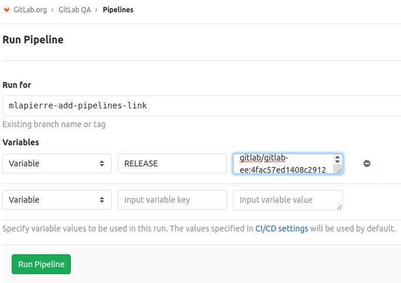

# How to add new test scenarios

## What is a scenario?

A QA test scenario is a set of tests that are run against a particular environment.

[Orchestrated scenarios are defined in the GitLab QA project](https://gitlab.com/gitlab-org/gitlab-qa/tree/master/lib/gitlab/qa/scenario/). They set up the environment that will be tested using Docker images, and then execute the tests via an instance-level scenario. See the [GitLab QA orchestrator README](https://gitlab.com/gitlab-org/gitlab-qa/blob/master/README.md) and the [architecture diagram](https://gitlab.com/gitlab-org/gitlab-qa/blob/master/docs/architecture.md) for more details.

Instance-level scenarios are defined in the [GitLab CE](https://gitlab.com/gitlab-org/gitlab-ce/blob/master/qa/qa/scenario) and [GitLab EE](https://gitlab.com/gitlab-org/gitlab-ee/blob/master/qa/qa/scenario) projects, and they contain the [end-to-end tests](https://gitlab.com/gitlab-org/gitlab-ce/tree/master/qa/qa/specs/features). Executing the end-to-end tests involves running an instance-level scenario against a particular instance of GitLab.

For more information about running tests, [please see the documentation](index.md#how-do-i-run-the-tests).

## Adding an orchestrated scenario

To add a new orchestrated scenario you need to add the scenario to GitLab QA, and you might also need to add an instance-level scenario to GitLab CE/EE too.

For example, to test Elasticsearch you would need to add [a new scenario](https://gitlab.com/gitlab-org/gitlab-qa/blob/2bb76796fb52abdcc1fd5e9034bb64fd0f3a1a7e/lib/gitlab/qa/scenario/test/integration/elasticsearch.rb) that runs Elasticsearch in a Docker container, runs GitLab in another Docker container, and [executes an instance-level scenario against the instance of GitLab running in the container](https://gitlab.com/gitlab-org/gitlab-qa/blob/2bb76796fb52abdcc1fd5e9034bb64fd0f3a1a7e/lib/gitlab/qa/scenario/test/integration/elasticsearch.rb#L32).

A slightly-edited sample of the code looks like:

```ruby
module Gitlab
  module QA
    module Scenario
      module Test
        module Integration
          class Elasticsearch < Scenario::Template
            ...

            def perform(release, *rspec_args)
              Component::Gitlab.perform do |gitlab|
                gitlab.release = release
                gitlab.name = gitlab_name
                gitlab.network = 'test'

                Component::Elasticsearch.perform do |elastic|
                  elastic.instance do
                    gitlab.instance do
                      puts "Running 'Test::Integration::Elasticsearch' specs!"

                      Component::Specs.perform do |specs|
                        specs.suite = 'Test::Integration::Elasticsearch'
                        specs.release = gitlab.release
                        specs.network = gitlab.network
                        specs.args = [gitlab.address, *rspec_args]
                      end
                    end
                  end
                end
              end
            end
          end
        end
      end
    end
  end
end
```
Each `Component` represents a Docker container, [`Component::Gitlab`](https://gitlab.com/gitlab-org/gitlab-qa/blob/2bb76796fb52abdcc1fd5e9034bb64fd0f3a1a7e/lib/gitlab/qa/component/gitlab.rb) represents the GitLab server container, [`Component::Elasticsearch`](https://gitlab.com/gitlab-org/gitlab-qa/blob/2bb76796fb52abdcc1fd5e9034bb64fd0f3a1a7e/lib/gitlab/qa/component/elasticsearch.rb) represents the Elasticsearch server container, and [`Component::Specs`](https://gitlab.com/gitlab-org/gitlab-qa/blob/2bb76796fb52abdcc1fd5e9034bb64fd0f3a1a7e/lib/gitlab/qa/component/specs.rb) represents the QA container that runs the tests.

The orchestration scenario could be executed via the command:

```
gitlab-qa Test::Integration::Elasticsearch EE
```

After starting Elasticsearch and GitLab containers, it would execute the instance-level scenario, `Test::Integration::Elasticsearch`.

## Adding an instance-level scenario

In most cases a new instance-level scenario is simply a subclass of the main instance-level scenario, `Test::Instance::All`, with a tag that restricts the tests to those created for the new scenario.

For example an instance-level Elasticsearch would look like:


```ruby
module QA
  module EE
    module Scenario
      module Test
        module Integration
          class Elasticsearch < Test::Instance::All
            tags :elasticsearch
          end
        end
      end
    end
  end
end
```

This executes all the tests in the `Test::Instance::All` scenario that have the tag `:elasticsearch`

## Testing a new instance-level scenario

A new instance-level scenario can be tested locally by [executing it via the command line](https://gitlab.com/gitlab-org/gitlab-ee/blob/master/qa/README.md#run-the-end-to-end-tests-in-a-local-development-environment), e.g., from the `qa` folder in the GitLab CE/EE project:

```
bin/qa Test::Integration::Elasticsearch http://localhost:3000
```

Note, this assumes you also have an Elasticsearch server running locally.

However, executing the scenario in CI will require running the orchestrated scenario.

## Testing a new orchestrated scenario

It's a little more complicated to test a new orchestrated scenario in CI than it is to test a new end-to-end test, because it depends on changes in the GitLab CE/EE and GitLab QA projects.

To briefly [explain the process](index.md#how-does-it-work), a [`package-and-qa` job](https://gitlab.com/gitlab-org/gitlab-ee/-/jobs/255700409) in the GitLab CE/EE project triggers an [omnibus-gitlab pipeline](https://gitlab.com/gitlab-org/omnibus-gitlab/pipelines/72021724) that triggers a [GitLab QA pipeline](https://gitlab.com/gitlab-org/gitlab-qa/pipelines/72023468), and that pipeline's jobs execute orchestrated scenarios (e.g., [`ee:instance`](https://gitlab.com/gitlab-org/gitlab-qa/-/jobs/255706794)). However, the GitLab QA pipeline runs against `master`, so if you want to include GitLab QA changes that haven't been merged yet, you can't simply start `package-and-qa`.

You could get the GitLab QA changes merged first, then test the GitLab CE/EE changes, but if you want to make sure the changes in both projects are compatible before merging either, you need to run a pipeline in GitLab QA on your branch, using a QA Docker image created via your GitLab CE/EE merge request.

To do so, first you need the GitLab Docker image name, which can be found in the `RELEASE` environment variable from [a GitLab QA job](https://gitlab.com/gitlab-org/gitlab-qa/-/jobs/255706794). You can get the value from the list of variables in the right sidebar of the job. In this example of an `ee:instance` job, it's `registry.gitlab.com/gitlab-org/omnibus-gitlab/gitlab-ee:4fac57ed1408c29121bc8446c8cdbcae515ac064`


The value can also be found in the job's logs. Close to the top of the logs it will show the `gitlab-qa` command, then a few lines later is the log of an attempt to use the GitLab Docker image and then pull it. E.g.:

```
exe/gitlab-qa Test::Instance::Image ${RELEASE:=EE}

...

Docker shell command: `docker run -d -p 80 --name gitlab-ee-3b4265e6 --net test --hostname gitlab-ee-3b4265e6.test --volume /builds/gitlab-org/gitlab-qa/gitlab-qa-run-2019-07-20-07-27-23-d1bf1a68/gitlab-ee-3b4265e6/logs:/var/log/gitlab:Z registry.gitlab.com/gitlab-org/omnibus-gitlab/gitlab-ee:4fac57ed1408c29121bc8446c8cdbcae515ac064`
Unable to find image 'registry.gitlab.com/gitlab-org/omnibus-gitlab/gitlab-ee:4fac57ed1408c29121bc8446c8cdbcae515ac064' locally
4fac57ed1408c29121bc8446c8cdbcae515ac064: Pulling from gitlab-org/omnibus-gitlab/gitlab-ee
```

The value you need for the `RELEASE` environment variable is in the line, `Unable to find image 'registry.gitlab.com/gitlab-org/omnibus-gitlab/gitlab-ee:4fac57ed1408c29121bc8446c8cdbcae515ac064' locally`.

Note that this Docker image is the GitLab image, not the QA image. GitLab QA will derive the QA image name from the GitLab image name.

You can use that value in [a new GitLab QA pipeline](https://gitlab.com/gitlab-org/gitlab-qa/pipelines/new) against your branch by selecting your branch instead of `master`, and add a `RELEASE` variable with the value you got from the job:



GitLab QA uses that GitLab Docker image name to derive the QA Docker image name. E.g., a GitLab Docker image with the name `registry.gitlab.com/gitlab-org/omnibus-gitlab/gitlab-ee:4fac57ed1408c29121bc8446c8cdbcae515ac064` corresponds to a QA Docker image named `registry.gitlab.com/gitlab-org/omnibus-gitlab/gitlab-ee-qa:4fac57ed1408c29121bc8446c8cdbcae515ac064` (note `gitlab-ee` vs. `gitlab-ee-qa`).

When you run that pipeline, it will use the changes in the GitLab QA branch, e.g., your new orchestrated scenario, and the changes in your GitLab CE/EE merge request, e,g., your new instance-level scenario and tests.
